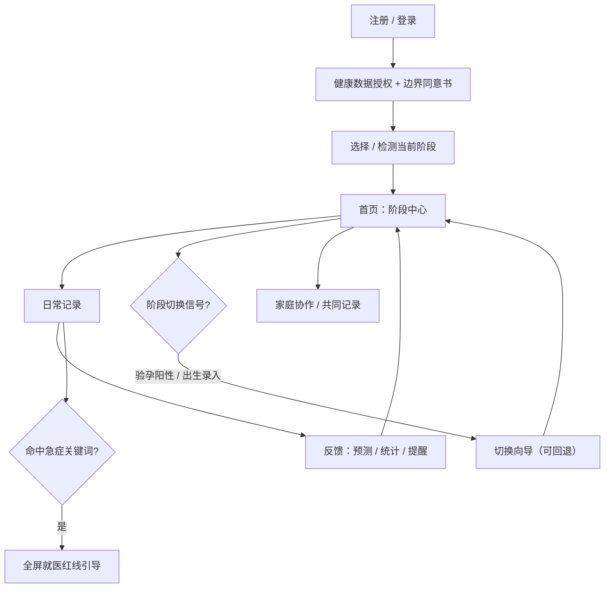

# 孕语 · 孕育全周期 App — 产品需求文档（PRD）

> 本文基于用户提供的《「孕育全周期」App 产品方案（深化版）》整理，作为设计与研发依据。本期交付聚焦 **MVP 范围**：单 App 阶段自动切换、核心记录、提醒系统、分阶段内容库，并预埋家庭账号与医疗合规边界。

## 1. 产品概述

陪伴女性从「备孕」到「宝宝 2 岁」全生命周期的智能孕育助手——记录、预测、提醒、知识一站式。

- **解决的问题**：市面备孕 / 孕期 / 育儿 App 相互割裂，用户每进入新阶段就换 App、重复录入。本产品用一个账号沉淀全周期健康档案，在「阶段切换」这个最易流失的时刻无缝承接用户。
- **目标用户**：备孕女性 → 孕妇 → 新手妈妈（数据主体），家庭角色（伴侣共同记录、祖辈围观），权威角色（医生 / 专家内容背书）。
- **产品价值**：以「单 App 阶段自动切换」为护城河，形成从备孕到 2 岁的连续健康档案与记录习惯。

## 2. 核心功能

### 2.1 用户角色

| 角色 | 加入方式 | 核心权限 |
|------|---------|---------|
| 妈妈（主账号） | 手机号 / 邮箱注册 | 数据主体，全部读写，管理提醒与授权 |
| 伴侣 | 家庭邀请码 | 孕产数据只读（可配置），宝宝 / 日常记录读写 |
| 祖辈 | 家庭邀请码 | 成长影像与动态只读，不触敏感医疗数据 |

### 2.2 功能模块（MVP 页面）

1. **首页（阶段中心）**：当前阶段状态卡、今日待办与提醒、快捷记录、按阶段内容推荐、家庭动态入口，随阶段自动切换。
2. **记录页**：按阶段聚合的记录入口与历史（周期排卵、体重、胎动、喂养、睡眠、尿布）。
3. **知识页**：分阶段 + 月龄双维内容库，含内容分级与来源审核标注。
4. **家庭页**：家庭成员、共同记录、成长动态时间线、提醒认领。
5. **我的页**：账号、授权管理、数据导出、阶段切换与设置、免责声明。
6. **阶段切换向导（弹层）**：验孕阳性 / 出生信息录入等触发的确认与回退流程。
7. **医疗合规组件**：免责声明、内容分级标注、急症红线全屏就医引导。

### 2.3 页面详情

| 页面名称 | 模块名称 | 功能描述 |
|---------|---------|---------|
| 首页 | 阶段状态卡 | 显示当前阶段与关键数据（如「孕 20 周 3 天 · 宝宝约 300g」「宝宝 6 月龄」），随状态机切换视觉与文案 |
| 首页 | 今日待办 | 汇总产检 / 补充剂 / 疫苗 / 喂养提醒，支持勾选完成、认领 |
| 首页 | 快捷记录 | 一键进入常用记录（随阶段：备孕打卡 / 胎动 / 喂养睡眠尿布） |
| 首页 | 内容推荐 | 按阶段 / 月龄推荐科普卡片 |
| 记录 | 周期与排卵 | 月经周期记录、排卵日 / 易孕期多信号预测、受孕概率（备孕阶段） |
| 记录 | 孕期身体数据 | 体重曲线（对照增重标准）、胎动计数、宫缩计时器 |
| 记录 | 育儿日常 | 喂养（母乳 / 奶粉 / 辅食）、睡眠、尿布记录与统计，标注记录成员 |
| 知识 | 分级内容库 | 按阶段 + 月龄双维过滤，卡片标注 L0-L3 分级、来源、审核状态 |
| 知识 | 免责声明 | L1/L2 内容固定展示「仅供参考，不替代医生」 |
| 家庭 | 成员管理 | 展示成员与角色、邀请码、权限矩阵、最小可见默认 |
| 家庭 | 共同记录 / 动态 | 多人记录实时合并、成长影像时间线、祖辈围观互动 |
| 我的 | 授权与数据主权 | 健康数据授权、导出 / 迁移 / 删除、分享链接失效设置 |
| 我的 | 阶段管理 | 手动回退 / 修正阶段、妊娠中断归档与心理支持入口 |
| 全局 | 急症红线 | 命中急症关键词强制全屏就医引导，优先于一切推荐逻辑 |

### 2.4 阶段状态机

八个连续阶段自动切换，日常记录以「宝宝」为主体持续沿用：

| 切换 | 触发信号 | 系统动作 | 用户侧 |
|------|---------|---------|--------|
| 备孕→怀孕 | 验孕阳性 + 末次月经确认 | 首页切孕周中心、隐藏排卵预测、建孕期档案 | 弹窗确认，可回退 |
| 孕周推进 | 孕周按时间递增 | 内容 / 产检表 / 建议随孕周切换 | 无 |
| 怀孕→分娩 | 宝宝出生信息录入 | 进入产后模式、孕周档案归档 | 出生表单引导 |
| 产后→养育 | 出院 / 产后 42 天 | 宝宝档案成为主视角、妈妈恢复保留入口 | 引导确认 |
| 月龄推进 | 出生日期计算月龄 | 内容 / 疫苗 / 辅食 / 里程碑随月龄切换 | 无 |
| 双阶段并行 | 孕晚期 | 保留待产模式：宫缩计时、待产包、产程引导 | 快捷入口 |
| 妊娠中断 | 主动标记 / 长期无活跃经确认 | 隐藏孕期内容、提供心理支持、数据归档加密不删除 | 可重启 / 导出 |

## 3. 核心流程

主用户流程：注册 → 授权与免责同意 → 系统定位当前阶段 → 首页展示阶段中心 → 日常记录 → 获得反馈（预测 / 统计 / 提醒）→ 阶段切换向导无缝承接 → 家庭成员协作。

## 4. 用户界面设计

### 4.1 设计风格

- **主色 / 辅色**：以温柔而克制的高级感为基调。主色采用低饱和「暖陶土 / 赤陶（terracotta clay）」`#C77B5A` 与「墨绿鼠尾草（sage ink）」`#4A5D4E` 双色系，中性底为「奶油宣纸（cream paper）」`#F5F0E8`，文字用「深墨棕」`#2B2420`。四大阶段各有一枚阶段强调色：备孕—暖杏、怀孕—赤陶、产后—鼠尾草、养育—雾蓝。避免母婴产品常见的粉紫甜腻配色。
- **按钮风格**：圆角 12px 的实心 / 描边按钮，克制的微投影，无 3D，无渐变滥用。主按钮实心陶土色，次按钮描边。
- **字体**：中文标题用「思源宋体 / Noto Serif SC」营造编辑杂志般的温度，正文用「思源黑体 / Noto Sans SC」保证清晰；数字与孕周等关键数据用衬线体加大字号突出。禁用 Inter/Roboto/Arial 等通用无个性字体作为主视觉。
- **布局**：移动端优先的卡片式布局，底部 5 Tab 主导航；首页采用杂志式层次（大状态卡 + 分区卡片），留白充足，非对称呼吸感。
- **图标 / emoji**：线性描边图标，笔触轻盈；阶段与情绪场景可少量使用克制的手绘感插画点缀，不用花哨 emoji 堆砌。

### 4.2 页面设计概览

| 页面名称 | 模块名称 | UI 元素 |
|---------|---------|---------|
| 首页 | 阶段状态卡 | 大号衬线数字（孕周 / 月龄）、阶段强调色渐隐背景、宝宝发育图示、载入时状态卡上浮淡入 |
| 首页 | 今日待办 | 卡片列表 + 勾选圈动画、完成划除、认领头像标记 |
| 首页 | 快捷记录 | 圆角图标网格，点按缩放反馈 |
| 记录 | 数据图表 | 体重 / 睡眠曲线、胎动计数环形进度、宫缩计时脉冲动画 |
| 知识 | 内容卡 | 分级色标（L0-L3）、来源与审核徽章、双维筛选 Chip |
| 家庭 | 成员 / 动态 | 成员头像行、权限矩阵表、成长时间线卡片 |
| 我的 | 授权设置 | 分组列表、开关、危险操作二次确认 |
| 全局 | 急症红线 | 全屏红底、就医指引与紧急联系方式、无关闭诱导 |

### 4.3 响应式

移动端优先（主平台为手机），最大内容宽度约束居中以适配平板 / 桌面预览；触摸优化（点击热区 ≥ 44px、滑动手势、底部安全区适配）。以 PWA 形态支持 iOS / Android 安装到主屏、离线记录。

## 5. 版本规划

- **MVP（本期交付前端）**：阶段首页（备孕 / 孕周 / 月龄状态）、核心记录（周期排卵、体重、胎动、喂养、睡眠、尿布）、提醒系统（补充剂 / 产检 / 疫苗）、基础分阶段内容库、医疗免责与授权体系、阶段切换状态机。
- **V1**：AI 助手与报告解读、家庭账号与共同记录、成长曲线、成长相册与报告。
- **V2**：社区、电商导购 / 会员、在线问诊、智能硬件、双胎支持。

## 6. 非目标

- MVP 不做社区、电商导购、在线问诊、会员体系。
- 不做任何诊断、治疗、用药结论（医疗红线）。
- 初期不做智能硬件对接与多平台原生，聚焦移动端 PWA。
- 不替代医院建档、产检、疫苗接种等线下医疗行为。
