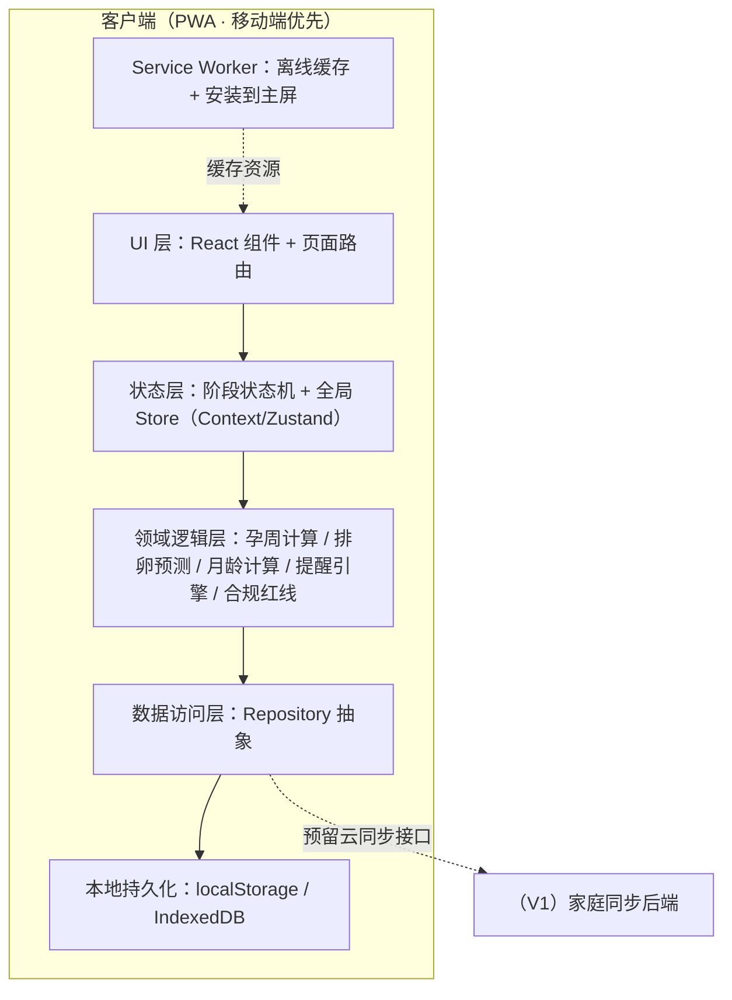
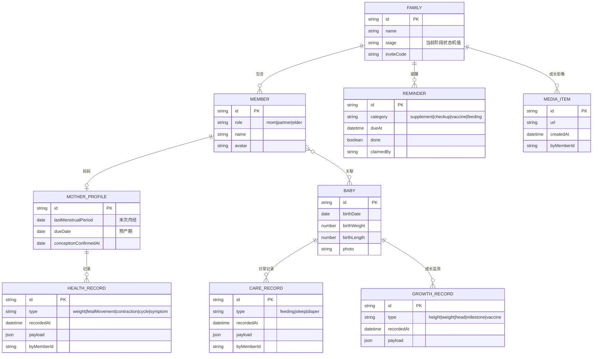

# 孕语 · 孕育全周期 App — 技术架构文档

> 本期为 **纯前端 MVP（PWA）**，无后端，数据以本地持久化（localStorage / IndexedDB）+ Mock 种子数据模拟，为后续家庭同步与云端预留接口抽象。

## 1. 架构设计



## 2. 技术说明

- **前端框架**：React@19 + TypeScript + Vite@7（已初始化 react-ts 模板）
- **样式方案**：Tailwind CSS@4（`@tailwindcss/vite` 插件）+ CSS 变量管理主题色板与阶段强调色
- **路由**：react-router-dom（5 Tab + 阶段向导 modal 路由）
- **状态管理**：Zustand（轻量，含 persist 中间件写入本地）——阶段状态机与用户/宝宝档案的单一数据源
- **图表**：recharts（体重 / 睡眠曲线、成长曲线）
- **动画**：Framer Motion（motion）——页面载入 staggered 淡入、状态卡上浮、微交互
- **PWA**：vite-plugin-pwa（Service Worker、manifest、离线缓存、安装到主屏）
- **图标**：lucide-react（线性描边图标）
- **字体**：Noto Serif SC（标题）+ Noto Sans SC（正文），通过字体资源引入
- **后端 / 数据库**：本期无；数据为本地持久化 + Mock 种子数据

## 3. 路由定义

| 路由 | 用途 |
|------|------|
| `/` | 首页 · 阶段中心（随阶段渲染不同重点） |
| `/record` | 记录页 · 按阶段聚合的记录与历史 |
| `/knowledge` | 知识页 · 分阶段 + 月龄双维内容库 |
| `/family` | 家庭页 · 成员、共同记录、成长动态 |
| `/profile` | 我的页 · 账号、授权、数据导出、阶段管理、设置 |
| `/onboarding` | 首次授权与免责同意书流程 |
| `/stage-switch` | 阶段切换向导（弹层路由，可回退） |
| `/emergency` | 急症红线全屏就医引导（全局可触发） |

## 4. 数据模型

### 4.1 数据模型定义



### 4.2 阶段状态机取值

```
ttc              备孕期
pregnancy        怀孕期（孕周推进）
pregnancy_late   孕晚期（待产模式并行）
labor            分娩当天
postpartum       产后 42 天恢复
parenting        0-2 岁养育（月龄推进）
paused           妊娠中断（归档 / 心理支持）
```

### 4.3 本地存储与合规

- 全部数据写入 `localStorage`（键前缀 `pregvoice:`），敏感健康数据在 Repository 层预留加密钩子。
- 内容分级 L0–L3 与免责话术、急症关键词表内置为静态配置（`src/data/`）。
- Repository 层统一 CRUD 接口，V1 可替换为云端实现而不改动 UI。
